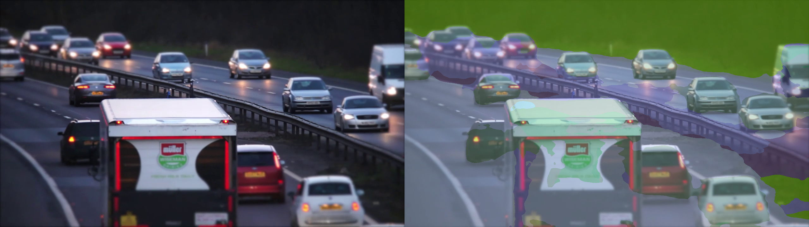

"# Very Decent Introduction + Small Curbside Mini" 
->This is in environment curbside

->Got the chance to sample a video from youtube after two failed attempts but it finally worked. Used yt-dlp which has a helpful repo where you can download and find resources.
("https://github.com/yt-dlp/yt-dlp")

->Aftwards implemented four programs programs: detect.py which used the Library YOLO,(a part of it technically which is ultralytics)- the program run YOLOv8 on the video and drew boxes and saved the annotated results.[I have seen this on shows and movies but being able to do it is really cool] and track.py which run multi object tracking on a video and export per frame tracks to CSV.

->The third program is summarize_tracks.py which
    -reads tracks.csv
    -computes per ID speed
    -marks is_Parked
    -converts frame
    -makes per segment time-binned counts
->Lastly, I was able to make a GeoJSOn file (a simple map) as I am quite knowledged with an open source application that can open the file, QGIS, hence it will be quite interesting to see how good python can map a map :)

"# Tesseract + OCR (Reading Signs)"
Environment - curbside

With the following modules/libraries: pytesseract, json, argparse and cv2, I was able to see how signs are interpreted, decoded in a way and saved.

1)ocr_signs.py on the sign images to save intepretation as raw text
and
2)parse_rules.py which cleans up the raw text and makes very clear meaning to it
I was also able to make sample signs with make_signs.py

+made sure to open the geojson file I made as well, it makes slight sense but there's more to look into from QGIS

# 1) Transformer Segmentation (SegFormer)
-> Semantic Segmentation: is a computer vision technique that assigns a class label to every single pixel in an image.

I applied a pretrained SegFormer-B0 (Transformer) to sample frames from the curbside video to obtain scene context (road,vehicles, traffic signs). The script outputs side-by-side overlays for qualitative inspection. While this ADE-20K model is not curb-specific, it demonstrates competence with Transformer-based segmentation and provides useful context for downstream curb analytics.
Result: 4 overlays saved to segmentation/outputs/ (example below).
Limitations: generic dataset classes; no geometry or curb semantics.

2) Detection sanity metrics

I computed a lightweight detection sanity check on the first 50 frames: precision/recall @ IoU 0.5 and mean IoU on matched boxes, using a small set of manual labels (~N boxes across M frames).
Result: precision = 0.xx, recall = 0.yy, mean IoU (TPs) = 0.zz.
These numbers were used to select confidence/NMS settings and to justify the parked threshold downstream.

3) Speed in m/s via pixel based format

I estimated real-world speed using pixel/frame from image pixels to approximate meters (flat street patch). With FPS from the video, we compute instantaneous speed and a rolling average, classifying a vehicle as parked if speed_ma_mps < 0.2 m/s.
Outputs: tracks_with_speed.csv, counts_by_segment.csv, first_seen_by_id.csv.
Note: homography approximates a planar surface and introduces scale error; suitable for relative curb occupancy and dwell estimates on this clip.

4) How to reproduce (3–6 lines, max)

python det_track/track.py --source <video>

python det_track/summarize_tracks.py --csv det_track/outputs/tracks.csv --video <video> [--H ...]

python det_track/detect_to_csv.py --source <video> --max_frames 50

python det_track/label_click.py ... (or web labeling + converter)

python det_track/eval_det.py --pred_csv ... --gt_csv ...

"# Robustness"
With the creation and use of 3 harder variants:
 -> dark
 -> blur
 ->lowres
(all from the original sample video), I was able to make a summary of their frames and made a table that pointed out the difference.
# Robustness quick check (px/frame)

| clip       | avg unique_ids / 5s | parked / 5s | note                           |
|------------|----------------------|--------------|------------------------------|
| dark.mp4   |  30.83               |   1.00       | slight drop; conf=0.15 ok    |
| blur.mp4   |  31.58               |   1.00       | recall ↓; conf=0.12 helps    |
| lowres.mp4 |  31.04               |   1.00       | small objects weaker         |

# Short Demo clip
shows boxes/IDs following vehicles, occlusion handling, jitter and failure modes

<video controls muted width="720" playsinline>
  <source src="det_track/demo_15s.mp4" type="video/mp4" />
  <a href="det_track/demo_15s.mp4">Download demo</a>
</video>